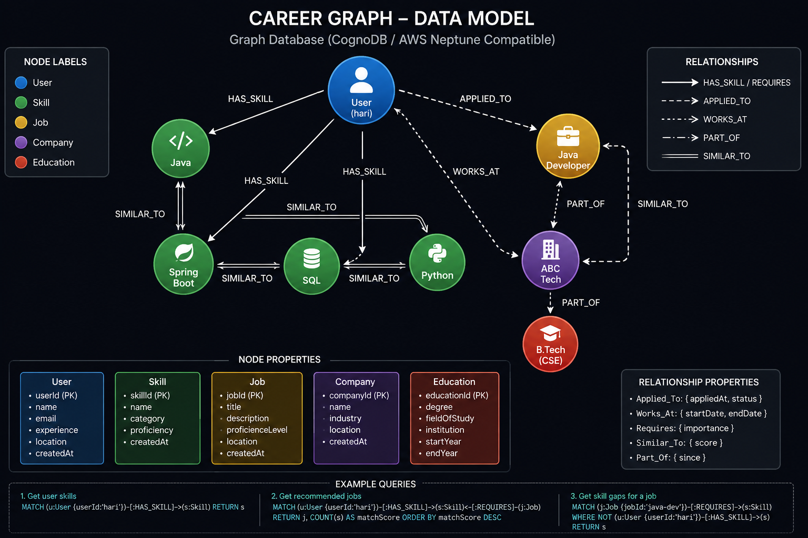

# CareerGraph

A graph-based job recommendation platform built with **Spring Boot, React, and CognoDB**.

CareerGraph recommends jobs based on a user's skills and provides match percentages, matched skills, missing skills, and skill-gap analysis.

## Features

- Job recommendations
- Skill-based match percentage
- Matched and missing skills
- Skill gap analysis
- Graph Explorer
- Job search
- Responsive UI
- Graph-based recommendation flow

## Technology Stack

### Backend

- Java
- Spring Boot
- Maven
- Neo4j Java Driver
- REST APIs

### Frontend

- React
- TypeScript
- Vite
- Tailwind CSS
- Axios
- React Router

### Database

- CognoDB
- openCypher
- Bolt protocol

## Architecture

```text
                    React Frontend
                  React + TypeScript
                         |
                         | REST API
                         v
                   Spring Boot
                      Backend
                         |
                         | Neo4j Java Driver
                         v
                      CognoDB
                         |
                         v
                   Graph Database
```

## Graph Model

The application uses four main node types:

- User
- Skill
- Job
- Company

Relationships:

- `HAS_SKILL`
- `REQUIRED_FOR`
- `OFFERED_BY`

```text
(User)
   |
   | HAS_SKILL
   v
(Skill)
   ^
   | REQUIRED_FOR
   |
(Job)
   |
   | OFFERED_BY
   v
(Company)
```

The recommendation flow is:

```text
User → Skill → Job → Company
```

Example:

```text
Hari
 |
 | HAS_SKILL
 v
Java
 |
 | REQUIRED_FOR
 v
Java Developer
 |
 | OFFERED_BY
 v
ABC Tech
```

## Why a Graph Database?

CareerGraph is relationship-focused.

A user is connected to skills, skills are connected to jobs, and jobs are connected to companies.

The graph database makes these relationships easy to traverse:

```text
User → Skill → Job → Company
```

This allows the application to find jobs based on a user's existing skills and identify the skills required for jobs that the user may be missing.

## Recommendation Example

Suppose a user has:

```text
Java
Spring Boot
MySQL
```

A job requires:

```text
Java
Spring Boot
Docker
```

The application calculates:

```text
Matched Skills:
Java
Spring Boot

Missing Skills:
Docker

Match Percentage:
66.67%
```

Another example:

```text
Job:
Cloud Developer

Company:
ABC Tech

Required Skills:
Java
Docker
AWS

Matched Skills:
Java

Missing Skills:
Docker
AWS

Match Percentage:
33.33%
```

## Skill Gap Analysis

The skill-gap feature compares the user's current skills with the required skills of a selected job.

```text
Current Skills
      |
      v
Required Skills
      |
      v
Missing Skills
```

Example:

```text
Target Job:
Cloud Developer

Current Skills:
Java
Spring Boot
MySQL

Required Skills:
Java
Docker
AWS

Missing Skills:
Docker
AWS
```

## Main Graph Query

The recommendation query uses a parameterized Cypher query:

```cypher
MATCH (u:User {name: $userName})
      -[:HAS_SKILL]->(userSkill:Skill)

WITH collect(DISTINCT userSkill.name) AS userSkills

MATCH (j:Job)-[:REQUIRED_FOR]->(requiredSkill:Skill)

WITH userSkills,
     j,
     collect(DISTINCT requiredSkill.name) AS requiredSkills

MATCH (j)-[:OFFERED_BY]->(c:Company)

WITH j,
     c,
     userSkills,
     requiredSkills,
     [skill IN requiredSkills
      WHERE skill IN userSkills] AS matchedSkills

RETURN j.name AS job,
       c.name AS company,
       matchedSkills,
       requiredSkills
```

The query demonstrates the graph traversal:

```text
User → Skill → Job → Company
```

and uses `$userName` as a parameter rather than concatenating user input into the Cypher query.

## API Endpoints

### Recommendations

```http
GET /api/recommendations/{userName}
```

Example:

```http
GET /api/recommendations/hari
```

### Skill Gap

```http
GET /api/skill-gap?userName={userName}&jobName={jobName}
```

Example:

```http
GET /api/skill-gap?userName=hari&jobName=cloud%20developer
```

### Graph Explorer

```http
GET /api/graph/user/{userName}
```

Example:

```http
GET /api/graph/user/hari
```

## Project Structure

```text
career-graph/
│
├── src/
│   └── main/
│       ├── java/
│       │   └── com/example/careergraph/
│       │       ├── config/
│       │       ├── controller/
│       │       ├── dto/
│       │       ├── repository/
│       │       └── service/
│       │
│       └── resources/
│
├── frontend/
│   ├── src/
│   │   ├── components/
│   │   ├── pages/
│   │   ├── services/
│   │   ├── hooks/
│   │   └── types/
│   ├── public/
│   ├── package.json
│   └── vite.config.ts
│
├── docs/
│   ├── graph-model.png
│
├── pom.xml
├── Dockerfile
├── README.md
└── .gitignore
```

## CognoDB Setup

Create a CognoDB Cloud instance and configure the backend using environment variables.

```env
COGNODB_URI=your-cognodb-uri
COGNODB_USERNAME=cognodb
COGNODB_PASSWORD=your-password
```

Do not commit database credentials to GitHub.

## Running Locally

### Backend

From the project root:

#### Windows

```bash
mvnw.cmd spring-boot:run
```

#### Linux / macOS

```bash
./mvnw spring-boot:run
```

Backend:

```text
http://localhost:8080
```

### Frontend

```bash
cd frontend
npm install
npm run dev
```

Frontend:

```text
http://localhost:5173
```

## Frontend Environment Variable

Create:

```text
frontend/.env
```

Add:

```env
VITE_API_BASE_URL=http://localhost:8080
```

For production, the frontend uses the deployed backend URL.

## Production Deployment

### Frontend

The React frontend is deployed using Vercel.

Live application:

https://career-graph-xigf-qe4zc99u8-hariharan1595s-projects.vercel.app/

### Backend

The Spring Boot backend is deployed using Render.

Backend:

https://careergraph-backend-mhns.onrender.com

### Production Flow

```text
User
 |
 v
Vercel
React Frontend
 |
 | REST API
 v
Render
Spring Boot Backend
 |
 | Neo4j Java Driver
 v
CognoDB
```

### Model screen short 

### Graph Data Model



## Demo
https://drive.google.com/file/d/19QX_NDLKMk5yvY2Lshm3Bxe4QhszmNPR/view?usp=sharing

### Live Application

https://career-graph-xigf.vercel.app

### Backend API

https://careergraph-backend-mhns.onrender.com

### Demo Video

[Watch CareerGraph Demo](YOUR_VIDEO_URL)


## Error Handling

The application handles:

- API errors
- Database connectivity problems
- Empty recommendation results
- Loading states
- Invalid requests
- Frontend API failures

The frontend provides appropriate loading, empty, and error states instead of displaying a blank page.

## Security

Sensitive configuration is stored using environment variables.

The following files should not be committed:

```text
.env
frontend/.env
database credentials
private API keys
passwords
```

Use `.env.example` files for configuration templates.

## Deployment URLs

| Service | URL |
|--|-|
| Frontend | https://career-graph-xigf-qe4zc99u8-hariharan1595s-projects.vercel.app/
| Backend | https://careergraph-backend-mhns.onrender.com |
| GitHub | https://github.com/Hariharan1595/career-graph.git |
| demo    |https://drive.google.com/file/d/19QX_NDLKMk5yvY2Lshm3Bxe4QhszmNPR/view?usp=sharing |

## Future Improvements

- User authentication
- Multiple user profiles
- Job application tracking
- Skill-to-skill relationships
- Learning resource recommendations
- Experience-based matching
- Location-based job filtering
- Advanced graph recommendation algorithms

## Author

**Hariharan R**


CareerGraph  
Graph-Based Job Recommendation Platform
